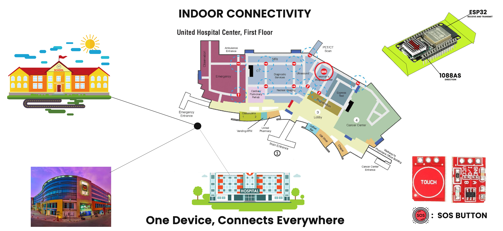
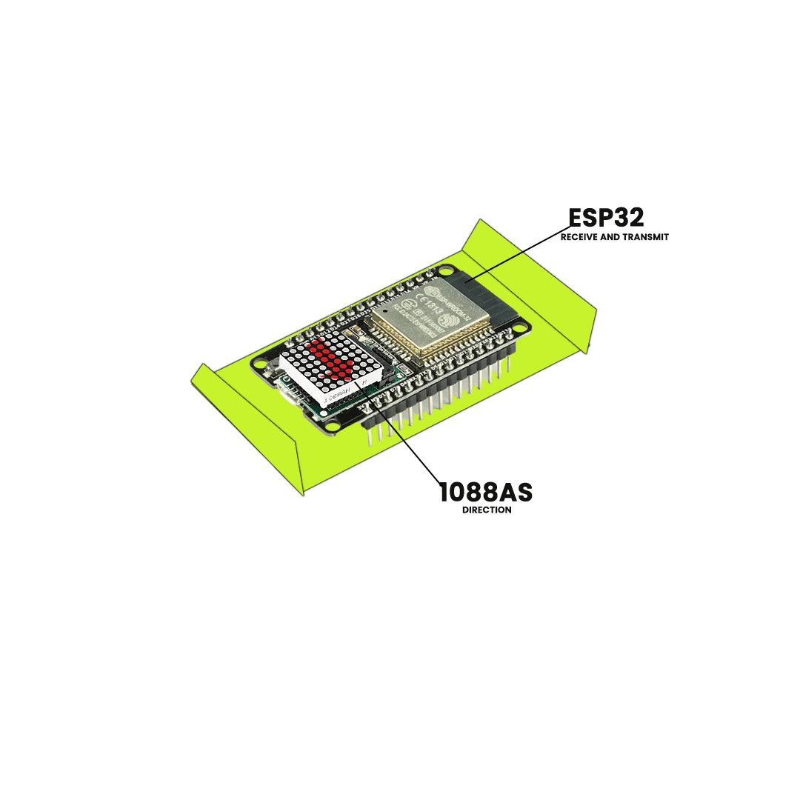

# Women Safety - Protecting Women from Safety Threats 🚺🔒

## Problem Statement (PS) Number: SIH1605

### Description

We are developing a **simulation** to demonstrate an innovative **indoor SOS system** designed to enhance women’s safety in workplaces. This system integrates real-time monitoring, analytics, and a physical SOS device to provide a comprehensive safety solution:

- **Real-time Monitoring & Analytics** 📊: Using **Caffe models** for person detection and gender classification (via `gender_net.caffemodel`, `age_net.caffemodel` with respective prototxt files), the system identifies the number of men and women present in the scene. In the event of a woman being surrounded by men, the system triggers immediate alerts for faster intervention.
- **SOS Button Activation** 🚨: Upon pressing the SOS button, nearby Bluetooth-connected LED panels light up with directional arrows pointing to the woman's location, enabling quick identification and assistance.
- **Accountability & Prevention** 📹: Cameras (as demonstrated in the simulation with `opencv_face_detector` models) and microphones capture real-time footage and audio to prevent misuse and ensure accountability.

This simulation presents a practical solution for enhancing workplace safety, providing both proactive and responsive measures to ensure women’s safety indoors.

---

### Technical Approach

#### Hardware Pre-requisites:

- ESP8266 🛠️
- BLE Module 📶
- ESP32 Cam Module 📸
- Buzzer 🔔
- LED 💡
- Switch 🔘

#### Software Resources:

- **Caffe Models**:
  - `gender_net.caffemodel` and `gender_deploy.prototxt` for gender classification. 🧑‍🤝‍🧑
  - `age_net.caffemodel` and `age_deploy.prototxt` for additional age-related data. 👶👴
- **OpenCV Face Detector**:
  - `opencv_face_detector_uint8.pb` and `opencv_face_detector.pbtxt` for face detection. 👁️

#### Software Functioning:

1. **Real-time Monitoring** ⏱️: Using **Caffe-based models** for gender and person detection, the system identifies high-risk situations. If a woman is surrounded by men, alerts are triggered for immediate assistance.
2. **SOS Button Activation** 🔔: Pressing the SOS button triggers a siren and lights up Bluetooth-enabled LED arrows, directing responders to the woman’s location.

---

### Social Impact

- **Faster Response** 🚀: Immediate detection of high-risk situations allows for quicker, life-saving interventions.
- **Empowerment** 💪: Women can feel safer knowing there’s a reliable tool available to assist them when needed.

---

### Hackathon Experience

This project was developed during our participation in **HackerWar 5.0**, the internal hackathon for the **Smart India Hackathon 2024** (SIH). The experience allowed us to refine our solution and collaborate effectively as a team.

**Team Members**:

- [Pritish Biswas](https://github.com/pritish-biswas) 👨‍💻
- [Anubhab Panda](https://github.com/anubhabpanda2003) 👨‍💻
- [Arghya Mukhopadhyay](https://github.com/braoninja79) 👨‍💻
- [Abhijit Bag](https://github.com/AbhijitCoder) 👨‍💻
- [Aruba Ariz](https://github.com/ArubaAriz) 👩‍💻
- [Adiba Arooj](https://github.com/adibaarooj) 👩‍💻

I would like to express our gratitude to the **CodeEsq Community** for their unwavering support throughout the development process. Our combined efforts and skills enabled us to build a great project, adding to our collective growth as developers. 🙏

---

### License

This project is licensed under the MIT License. See the [LICENSE](LICENSE) file for details.

---

### Visuals

#### Indoor Connectivity

#### ESP32 Module

